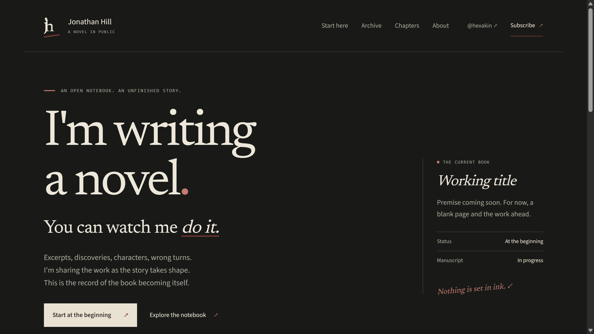
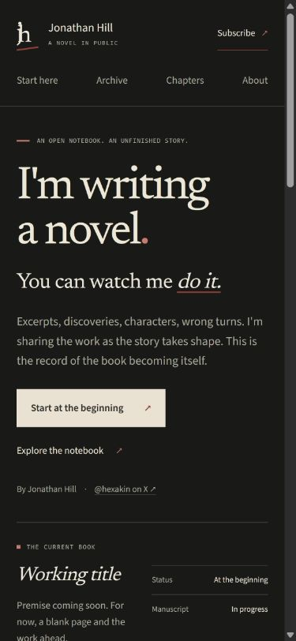
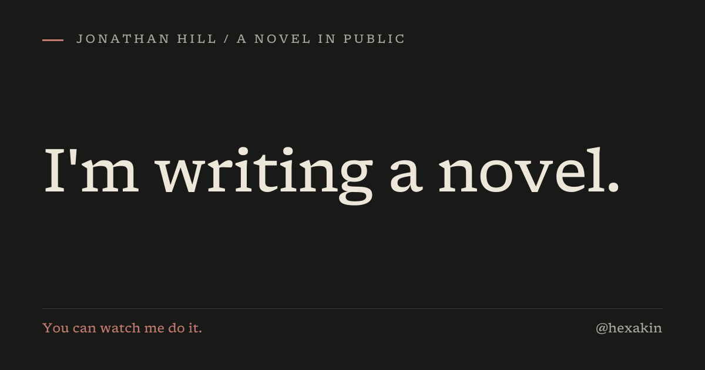

# Verification · 15 September 2026

## Passed

- `npm run lint` — no lint errors.
- `npm run typecheck` — Next route types and TypeScript passed. Final production build also completed its TypeScript check.
- `npm test` — 21 tests passed. Covers deterministic archive ordering/filtering, private projection, withdrawn bodies, reversible global withdrawal, strict schema/dates, publication report, XML escaping/RSS, Markdown sanitisation, consent, missing provider settings, successful mocked transport, provider failures/timeouts, honeypot, origin/size checks, per-address limiting and production-disabled local mocks.
- `npm run build` — real-content production build passed, generating 21 static endpoints/pages. No fake writing entries or chapter dates in the real content. No build warnings after tightening the filesystem tracing/project root.
- Populated production fixture build — 11 public pages and 22 internal links verified; real HTTP pages, metadata, RSS, sitemap, social PNG size, 404, private-record 404s and private/withdrawn sentinels checked in generated HTML/RSC/client artifacts.
- Global-withdrawal production fixture build — same page/history/link counts preserved, no public full-chapter bodies or marked manuscript excerpts/bodies. Report showed zero public full-text chapters. CLI restore preserved individual withdrawn statuses and source bodies.
- Final real-content preview — 6 public pages and 17 internal links verified, correct canonical domain, RSS/XML content type, sitemap, share PNG (1200×630), unknown share/filter input, 404/noindex, no QA fixture content, no secret sentinel in client output, and safe unconfigured signup (503).
- `git diff --check` — passed.

Unit fixture data is independent of production writing, so adding real entries does not break tests that expect an empty site. The final build consumes `content/`, not `.qa/content`.

## Browser review

Inspected the actual live site before replacement, then the rendered redesign at desktop and phone sizes (390 px and 320 px). Tested mobile archive filters, long title wrapping, archive-to-related-chapter navigation, a long manuscript reader, withdrawn chapter history, newsletter consent/confirmation/error states, and missing-config feedback. Local signup tests never sent or stored email. Keyboard testing confirmed visible focus on Skip to content; main landmarks were made focusable to support the skip destination.

The 320 px display size was reduced after it split “I'm writing” awkwardly. The manuscript remains a separate warm-paper reading surface. No horizontal content overflow was found by inspecting rendered dimensions at phone sizes. Header navigation remains visible without a hamburger/menu dependency. Focus and reduced-motion rules are built into the CSS.

Palette contrast calculations: bone/desk 14.18:1; muted/desk 7.38:1; red annotation/desk 5.38:1; ink/paper 10.53:1; muted/paper 5.14:1. These are token calculations, not a claim of exhaustive accessibility certification.

Screenshots are local review assets, not loaded by the website:

## Remaining setup and limits

1. Add your actual working title, premise and genuine project start date when ready. Initial archive/chapters are intentionally empty; title/date/day/word-count placeholders are not represented as facts.
2. Create/approve the newsletter account, set its API/group variables, enable and verify API double opt-in, review the processor/privacy notice and confirm the contact mailbox. Live provider acceptance and email delivery were not tested without credentials. No newsletter was sent.
3. Review and authorise deployment through the existing Vercel project. No production deploy, remote push or DNS change was performed. The initial state and assets are recoverable from the bundle/Git history.
4. Publication withdrawal still needs manual review of unmarked prose, public repositories, cached/previous deployments and external X Articles. It provides no Amazon compliance guarantee.
5. There is one current book in this version. Phase progression is configured and implemented; multiple-book chapter grouping is a small future content-schema extension, not a CMS or redesign.
6. No field Core Web Vitals, Lighthouse score or assistive-technology certification is claimed. This preserves a small server-rendered stack, self-hosted fonts and no extra third-party scripts. The archive is server-rendered for filter/order queries; chapters and other reading surfaces are prerendered.

## Repeat local checks

See README for real preview checks and isolated populated/withdrawal builds. Stop the production preview before rebuilding; remove `CONTENT_DIR` and local mock flags before a real deployment. The default smoke test uses the honeypot, so it cannot create a subscriber. The explicit `--unconfigured` test requires absent provider credentials.
